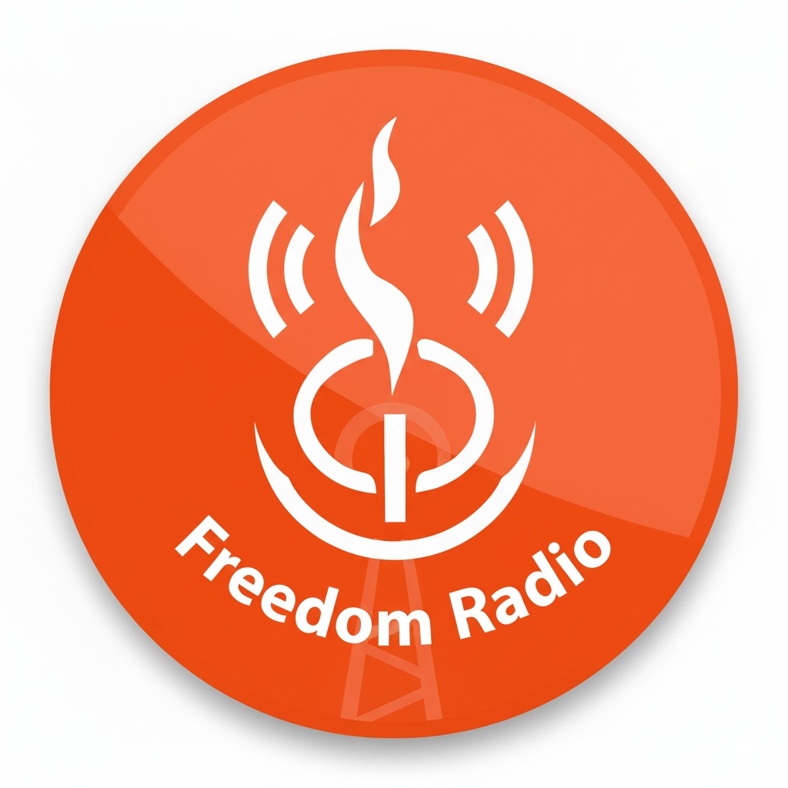

# CLC Freedom Radio 📻

A modern, serverless **"Simulated Live"** radio station application built for CLC Freedom Church. This app synchronizes audio playback globally, ensuring every listener hears the same content at the exact same time, whether it's a scheduled sermon or a worship song.


## 🚀 Key Features

### 🔴 Simulated Live Broadcasting
* **Time-Synced Playback:** Uses strict server-time logic to calculate exactly where a track should be playing. If a user joins 10 minutes late, the audio starts at the 10-minute mark.
* **Seamless Transitions:** Automatically switches between "Live Sermon Mode" and "Worship Filler Mode" based on the schedule.

### 🎵 Intelligent Worship Engine
* **Global Sync:** Worship songs are not just random loops. The app calculates a global loop position so that all connected users hear the same song in unison, creating a shared community experience.
* **Auto-Shuffle:** cycles through a curated playlist of worship music when no sermon is scheduled.

### 👥 Real-Time Community
* **Live Listener Count:** Uses Firebase Realtime Database (Presence System) to show a live count of active listeners across all devices.
* **PWA Support:** Fully installable on iOS and Android as a native-like app.

### 🛡️ Admin Dashboard
* **Secure Access:** Password-protected admin panel (`/admin` via lock icon).
* **Bulk Upload:** Parse and upload 24-hour schedules from text files instantly.
* **Conflict Detection:** Prevents scheduling overlapping shows.
* **Management:** Delete specific entries or wipe future schedules.

---

## 🛠️ Tech Stack

* **Frontend:** React (Vite) + TypeScript
* **Styling:** Tailwind CSS (Glassmorphism UI)
* **Database:** Firebase Firestore (Schedule & Content)
* **Real-time:** Firebase Realtime Database (Listener Counts)
* **Audio Hosting:** Archive.org (MP3 Streaming)
* **Hosting:** Vercel

---

## ⚙️ Logic & Architecture

### The "Simulated Live" Engine
The core of the app is the `useRadioSchedule` hook. It runs a tick every second:
1.  **Check Time:** Compares `Date.now()` against Firestore `startTime` + `duration`.
2.  **Determine State:**
    * **If Match:** It enters **Live Mode**. It calculates `offset = now - startTime` and forces the HTML5 Audio element to seek to that timestamp.
    * **If No Match:** It enters **Worship Mode**. It calculates the total duration of the filler playlist and determines the current song based on the modulo of the current epoch time.

---

## 🚀 Getting Started

### Prerequisites
* Node.js (v18+)
* Firebase Project

### Installation

1.  **Clone the repo**
    ```bash
    git clone [https://github.com/your-username/clc-radio.git](https://github.com/your-username/clc-radio.git)
    cd clc-radio
    ```

2.  **Install dependencies**
    ```bash
    npm install
    ```

3.  **Environment Variables**
    Create a `.env` file in the root directory and add your Firebase keys:
    ```env
    VITE_API_KEY=your_api_key
    VITE_AUTH_DOMAIN=your_project.firebaseapp.com
    VITE_PROJECT_ID=your_project_id
    VITE_STORAGE_BUCKET=your_project.appspot.com
    VITE_MESSAGING_SENDER_ID=your_sender_id
    VITE_APP_ID=your_app_id
    VITE_DATABASE_URL=[https://your-rtdb-location.firebasedatabase.app/](https://your-rtdb-location.firebasedatabase.app/)
    VITE_ADMIN_PASSWORD=your_secure_password
    ```

4.  **Run Locally**
    ```bash
    npm run dev
    ```

---

## 📱 Admin & Management

To access the Admin Panel:
1.  Open the app.
2.  Scroll to the footer.
3.  Click the small **Lock Icon** 🔒.
4.  Enter the PIN configured in your `.env` file.

**Bulk Upload Format:**
The admin panel accepts text blocks in this format:
```text
title: Sunday Service
artist: Apostle Segun
audioUrl: [https://archive.org/download/](https://archive.org/download/)...
startTime: 30/11/2025 | 09:00 AM
durationSeconds: 01:30:00

-----

## 📦 Deployment

This project is optimized for **Vercel**.

1.  Push code to GitHub.
2.  Import project into Vercel.
3.  Add the Environment Variables from your `.env` file into Vercel Settings.
4.  Deploy.

-----

## 📄 License

This project is licensed under the MIT License.